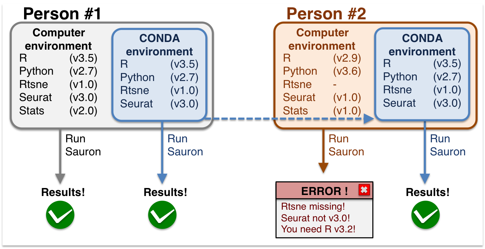

% Savio intermediate training: Conda/Mamba
% April 18, 2024
% Chris Paciorek and Jeffrey Jacob


# What is Conda?

- Conda is an open source package and environment management system.
- If you are installing Conda on your local machine you can pick between Miniconda and Anaconda.
- Conda can manage packages for a wide variety of programming languages but is most often used with Python.
- works well across multiple platforms (macOS, Windows, Linux)

# What are Conda Environments?

- Conda environments are isolated spaces created within Conda that allow users to use and manage different versions of Python and packages.
- Each Conda environment can have its own set of packages without affecting other environments.
- Environemnts ensure reproducibility of code and help avoid conflicts between package versions.

<center></center>
(Image from https://nbisweden.github.io/excelerate-scRNAseq/conda_instructions.html)

# Conda Vs Mamba
- Conda may be slow at times.
- Mamba is a faster drop in replacement for conda which is implemented in c++ and takes advantage of parallel loading.
- Mamba and Conda can be used interchangably just change the prefix conda to mamba for each command.

Mamba can be installed like such, remember you may need to install it again inside your conda environment as conda environments are blank slates

```bash
conda install mamba -c conda-forge
```

Note: As Savio upgrades to the Rocky8 operating system (in the coming months) mamba can be set as the default solver in conda by doing the following in your base environment:
```bash
$ conda install -n base conda-libmamba-solver
$ conda config --set solver libmamba
```
  
# Why Should We Use Them?

- Dependency Management
  -  manage project specifiic dependencies without affecting other projects on the system
- Reproducibility
  - scientific computing, Jupyter Kernels
- Collaboration
  -  share environments with others, easy to export, everyone works with same packages
- Cross-Platform
  -  environments work the same way across operating systems


# Setting and Creating Environments 

- In Savio a Conda Environment can be set up like such:
  - we can specify packages to add at time of creation by including them to the right of our command ie. `numpy`
  - we can set our version of python ie. `python=3.10` doing so isolates the environment's python from your system's base python installation

note:  We can set the version of our packages
```bash
module load python
conda create --name=test_env python=3.10 numpy=1.26.4
```

We can do the same thing using mamba

```bash
mamba create -c conda-forge --name test_env2 python=3.10
```

Afterwards we can view all of our environments and where they are located with the following command:

```bash
conda env list
```
the output may look something like this, the environment we are in currently will be marked by a *

```
pyspark               *  /global/home/users/jejacob/.conda/envs/pyspark
pytorch                  /global/home/users/jejacob/.conda/envs/pytorch
                         /global/scratch/users/jejacob/envs/ani
base                     /global/software/sl-7.x86_64/modules/langs/python/3.10
```

# Conda Channels
Why did we include `-c conda-forge` in our command?

- Conda Channels are the locations where the actual packages are stored common channels include: 
  - Anaconda: The default channel, it hosts a large number of packages and is considered stable.
  - conda-forge: A Community driven channel that has a larger number of packages than anaconda and often has newer versions.
  - nvidia: This channel is specifically for packages optimized for NVIDIA hardware, like GPU-accelerated libraries.
  
- It is generally a good idea to opt for the conda-forge channel for more up to date packages and a broader selection

conda-forge can be set as the priority channel like such:

```bash
conda config --add channels conda-forge
conda config --set channel_priority strict
```


# Activating, Adding to, and Deleting Environments

- Environments can be activated using `source activate` or `conda/mamba activate`
- `source` is [recomended on Savio](https://docs-research-it.berkeley.edu/services/high-performance-computing/user-guide/software/using-software/using-python-savio/) as using conda activate might require the use of `conda init` which can alter ther shell behavior due to modifiying `.bashrc` conda may now attempt to start a base environment when 
logging into the shell causing slowdowns.

- If you do use conda init you can stop base environment setup with the following:
  
```bash
  conda config --set auto_activate_base False
```

Let's activate our environemnt

```bash
source activate test_env2
```

To add to an environment we use the install command while in a environment

```bash
mamba install -c conda-forge flake8
```


To exit the environment:
```bash
source deactivate
```

Finally we can delete our environment if we no longer need it
```bash
mamba remove --name test_env2 --all
```
# Installing Packages via Pip and Isolating Environments
- We can also install packages in conda environments through pip
  - This is generally not recomended if there is a Conda version of the package as pip and conda may resolve dependancies differently.
  
If we do install via pip in a environment ensure the installation will be confined to the environment, avoiding impacts on the global `~/.local directory`.
```bash
source activate test_env
pip install black
```
 It is important to note  a Conda environment may not be completely isolated if it uses packages installed in the user's home directory `~/.local`, this can happen when packages were installed using `pip install --user` outside of the Conda environment.

You can check all of the packages installed in your environment and if any are from your local directory with the following:

```bash
conda list
```
If you find that you are using packages from `~local` you can reinstall them in your environment to ensure your environment uses its own isolated versions of those packages

# Creating and Using Export Files

- Part of the reason Conda is so popular is the ability to share environments with anyone streamlining the development process.
- the actual export file is written in `yaml` and dictates how the environment should be set up, here is an example of what one may look like:

```yml
name: myenv-exp
channels:
  - conda-forge
  - defaults
dependencies:
  - numpy
  - python=3.10
  - pip:
    - flake8

```
You can generate one of these based on your current environment configuration as follows, make sure you are in a env:

```bash
mamba env export > environment.yml
```

You can create a conda env based on a configuration file like such:

```bash
mamba env create -f env.yml
```

# Deleting Unused Packages and Creating Conda Environments in Scratch

- Up to now all of our environments have been saved to our local directory in the `.conda` folder. On Savio we are granted 10 gb of storage space on local, this can quickly fill up esspecially when working with larger packages.
- `~/.conda/pkgs` Directory: This subdirectory within ~/.conda stores package caches. Whenever you install a package using Conda, it downloads these packages as compressed files and stores them here before extracting them into the specified environment. Keeping these files allows Conda to avoid downloading them again if you need to reinstall a package.
- Deleting a conda env thus does not actually delete the associated packages, it is best practice to occasionally clean `.conda/pkgs` for this reason to save disk spack and maximize performance.


To delete unused packages:
```bash
conda clean --packages
```
to delete all cached packages:
```bash
conda clean --all
```

- Of course this is oftetimes not feasible as there are no unused packages and you do not want to delete anything. Saving conda environments to the scratch directory is a great way to circumvent the 10gb storage limit on local.

This can be done as such
```bash
conda create --prefix /global/scratch/users/jejacob/conda/scratch_myenv python=3.8 
```
This environment can be activated from anywhere on Savio like such:
```bash
source activate /global/scratch/users/jejacob/envs/scratch_myenv 
```
Lastly to expedite the proccess you can move your `.conda` directory itself to scratch and using a Symbolic Link to preserve the file paths
```bash
mv /global/home/users/user_name/.conda /global/scratch/users/user_name/

ln -s /global/scratch/users/user_name/.conda /global/home/users/user_name/.conda
```

# Using our environment as a Jupyter Kernel
- Another popular reason to use conda is its great integration with Jupyter Notebooks
- Jupyter notebooks are very popular on Savio and can be accsessed through [Open on Demand](https://docs-research-it.berkeley.edu/services/high-performance-computing/user-guide/ood/jupyter/)

To add a conda env as a Jupyter Kernel you can do the following, make sure `Jupyter` and `Ipykernel` are installed on the environment

```bash
source activate test_env
mamba install jupyter ipykernel
python -m ipykernel install --user --name=test_env --display-name="Python (test)"
```

To view all your kernels:
```bash
jupyter kernelspec list
```
And to remove one:
```bash
jupyter kernelspec remove <kernel-name>
```

# .condarc For Configuration
- The .condarc file is a configuration file for Conda that lets you customize how Conda behaves. 
  - usually located in the home dir

Many of the commands we've used throughout this demo have modified `.condarc` ie. our channel config
```bash
conda config --add channels conda-forge
conda config --set channel_priority strict
```
Let's modify our `.condarc` so that every new Conda environment we create includes Numpy by default
```bash
create_default_packages:
  - numpy
```

# Using Conda/Mamba for non-Python related software

- Like with Python packages, Mamba and Conda can create isolated environments for other languages and tools, ensuring that different projects with varying dependencies do not interfere with each other.
- They can manage packages for R, Ruby, Lua, Scala, Java, JavaScript, C++, Fortran, and more. This includes support for managing system libraries and binaries.
-  Both utilize the Anaconda repository and Conda-forge, a community-driven collection of repositories that significantly expand the number and types of packages available.
  
An R example:
```bash
mamba create --name my-r-env r-essentials r-base
mamba activate my-r-env
```
C++ example:
```bash
mamba create --name cpp-env
mamba activate cpp-env
mamba install -c conda-forge boost
mamba install -c conda-forge cmake
```

# How to get additional help

 - For technical issues and questions about using Savio:
    - brc-hpc-help@berkeley.edu
 - For questions about computing resources in general, including cloud computing:
    - brc@berkeley.edu or research-it-consulting@berkeley.edu
    - office hours: Wed. 1:30-3:00 and Thur. 9:30-11:00 [on Zoom](https://research-it.berkeley.edu/programs/berkeley-research-computing/research-computing-consulting)
 - For questions about data management (including HIPAA-protected data):
    - researchdata@berkeley.edu
    - office hours: Wed. 1:30-3:00 and Thur. 9:30-11:00 [on Zoom](https://research-it.berkeley.edu/programs/berkeley-research-computing/research-computing-consulting)
 - Status & Service Updates
    - The best way to stay updated on the latest status and updates for the Research IT services is on the front page of the Research IT website. If you are having issues or unsure if one of our services is down, check there first before sending us a ticket. 